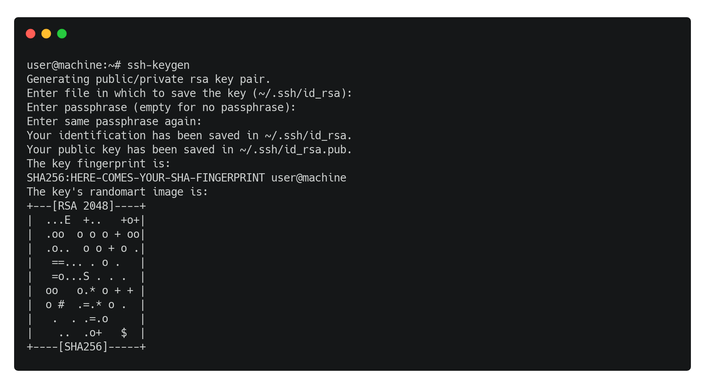
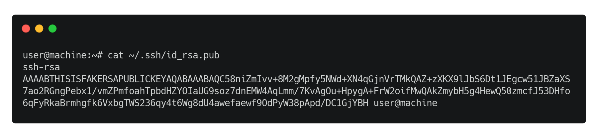
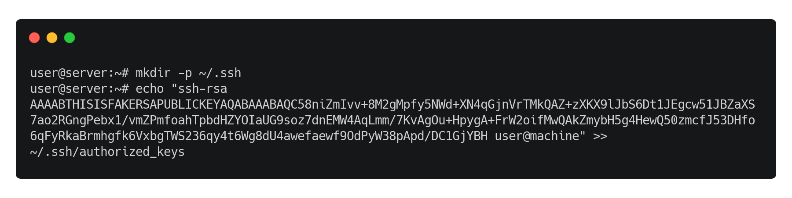

# KAIST-AI Server 설정

## SSH 설정

### 비밀번호 없이 SSH 접속하기

```bash
# 사용자의 컴퓨터에서 실행
ssh-keygen
# 이후 프로그램이 종료될 때까지 계속 enter 키 입력
```



```bash
# 사용자의 컴퓨터에서 실행
cat ~/.ssh/id_rsa.pub
# 이후 출력된 키 복사 (Ctrl+C)
```



```bash
# 서버에서 실행
mkdir -p ~/.ssh
echo "복사한 id_rsa.pub 키" >> ~/.ssh/authorized_keys
```



### 로그인 메시지 없애기

```bash
touch ~/.hushlogin
```

## ZSH 설치

### ncurses 설치

```bash
# 서버에서 실행
mkdir tmp
cd tmp

wget ftp://ftp.invisible-island.net/ncurses/ncurses.tar.gz
tar -zxvf ncurses.tar.gz

cd ncurses-6.2 # version number may differ
./configure --prefix=$HOME/.local --enable-shared CXXFLAGS='-fPIC' CFLAGS='-fPIC'

make
make install
```

### zsh 설치

```bash

git clone git://github.com/zsh-users/zsh.git
cd zsh

autoheader
autoconf

./configure --prefix=$HOME/.local --enable-shared PATH=$HOME/.local/bin:$PATH LD_LIBRARY_PATH=$HOME/.local/lib:$LD_LIBRARY_PATH CFLAGS=-I$HOME/.local/include CPPFLAGS=-I$HOME/.local/include LDFLAGS=-L$HOME/.local/lib

make
make install
```

### oh-my-zsh 설치

```bash
# oh-my-zsh
sh -c "$(wget -O- https://raw.githubusercontent.com/ohmyzsh/ohmyzsh/master/tools/install.sh)"
# 설치 후 0번 선택

# zsh-autosuggestions
git clone https://github.com/zsh-users/zsh-autosuggestions.git ${ZSH_CUSTOM:-~/.oh-my-zsh/custom}/plugins/zsh-autosuggestions

# zsh-syntax-highlighting
git clone https://github.com/zsh-users/zsh-syntax-highlighting.git ${ZSH_CUSTOM:-~/.oh-my-zsh/custom}/plugins/zsh-syntax-highlighting

sed -i 's/robbyrussell/agnoster/' ~/.zshrc
sed -i 's/plugins=(git)/plugins=(\ngit\nzsh-autosuggestions\nzsh-syntax-highlighting\n)/' ~/.zshrc

echo -e "\n$(which zsh)\nexit" >> ~/.bashrc
```

### 정리

```bash
cd ~
rm -rf tmp
```
